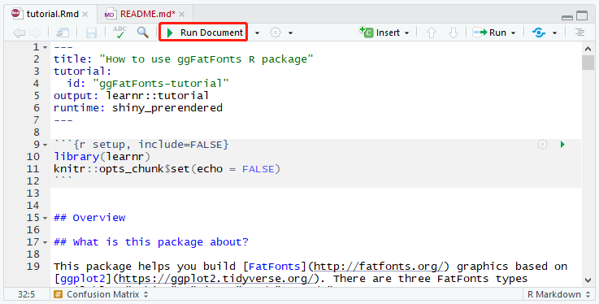

# ggFatFonts

## What is this package about?

This package helps you build [FatFonts](http://fatfonts.org/) graphics based on [ggplot2](https://ggplot2.tidyverse.org/). There are three FatFonts types available: "Cubica", "Miguta" and "Rotunda".

There are currently four quick plot functions provided: `ggFFConfMatr`, `ggFFHeatMap`, `ggFFCorrMatr` and `ggFFClusScatPlot`. They help to draw FatFonts Confusion Matrix, Heatmap, Correlation Matrix and Cluster Scatter Plot respectively. If you want to build some other plots using FatFonts, you can use `addGGFFLayer` function.

This package only works on Windows OS for now.

## Some quick examples

### Confusion Matrix

    library(ggFatFonts)
    ggFFConfMatr(confMatrTestData$`actual value`, confMatrTestData$`predicted value`)
    

{width="100%"}

### Heatmap

    library(ggFatFonts)
    library(ggplot2)
    cols <- topo.colors(9)
    ggFFHeatMap(x = txhousing$year[1:2000], y = txhousing$city[1:2000], z = txhousing$sales[1:2000], xAxisTitle = 'year', yAxisTitle = 'city', zAxisTitle = 'sales', fontSize = 2, changeFontColDigit = cols)

{width="100%"}

### Correlation Matrix

    library(ggFatFonts)
    library(ggplot2)
    changeFontColValueFunc <- function(oldPlot){
      newPlot <- oldPlot + scale_color_gradient2()
      return(newPlot)
    }
    ggFFCorrMatr(mtcars[c(1, 3:7)], changeFontColValue = changeFontColValueFunc, adjustPos = 1, fontSize = 1)
    

{width="100%"}

### Cluster Scatter Plot

    library(ggFatFonts)
    library(ggplot2)
    changeBackColFunc <- function(oldPlot){
     newPlot <- oldPlot + scale_fill_gradient(low = 'white', high = 'purple')
     return(newPlot)
    }
    ggFFClusScatPlot(mpg$cty, mpg$hwy, xAxisTitle = 'cty', yAxisTitle = 'hwy', changeBackCol = changeBackColFunc, fontSize = 1.6)
    

{width="100%"}

## How to use this package

A tutorial is provided to get you started. However, there are several things you need to do before running the tutorial. Please follow the instructions below.

### Step 1 Install fonts

Download the font files __Cubica.otf__, __Miguta.otf__ and __Rotunda.otf__ from the __fonts__ subdirectory.

### Step 2 Install libraries

Run the following codes in R to install `learnr`, `devtools`, `ggplot2` and `ggFatFonts` if you haven't installed them before:

    install.packages("learnr")
    install.packages("devtools")
    install.packages("ggplot2")
    devtools::install_github("purpleleaf95/ggFatFonts")

### Step 3 Run the tutorial for the first time (optional)

If you are running the tutorial for the first time on your machine, the tutorial files need to be re-rendered. Please follow the instructions below:

1. Find the local path where R libraries are stored. The default installing directory for Windows users is usually `C:\Program Files\R\R-3.x.x\library`. (Replace 3.x.x with the R version you are currently using) If you cannot find the path, open RStudio and click __Tools -> Global Options... -> General__. You will find the path in the __R version__ block.
2. Add `\ggFatFonts\tutorials\tutorial` to the end of your local path (i.e. `C:\Program Files\R\R-3.x.x\library\ggFatFonts\tutorials\tutorial` if you installed R using default settings). Find the __tutorial.Rmd__ file and open it in RStudio.
3. Click `Run Document`.

{width="80%"}

4. Wait for several seconds and a window containing the tutorial will then jump out.

### Step 4 Enjoy the package

Next time you want to open the tutorial, simply run the following code:

    learnr::run_tutorial(name = 'tutorial', package = 'ggFatFonts')
