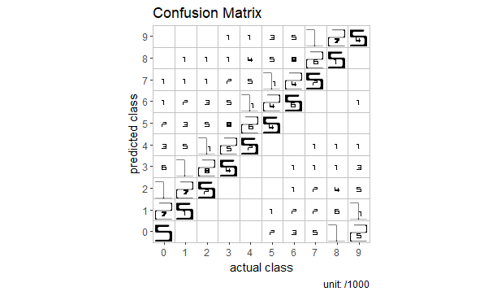
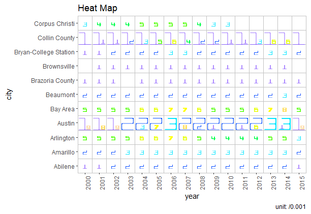
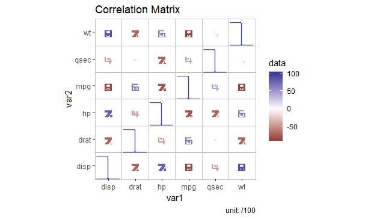
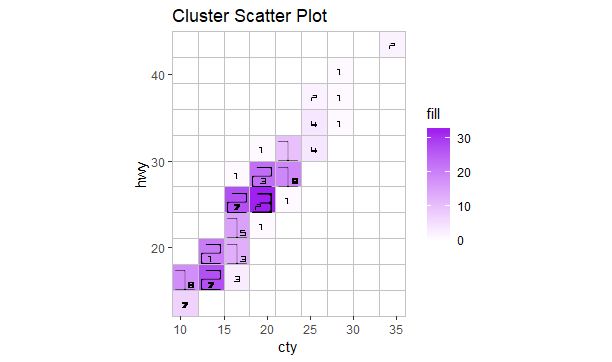

```{r setup, include=FALSE}
library(learnr)
knitr::opts_chunk$set(echo = FALSE)
```


## Overview

### What is this package about?

This package helps you build [FatFonts](http://fatfonts.org/) graphics based on [ggplot2](https://ggplot2.tidyverse.org/). There are three FatFonts types available: "Cubica", "Miguta" and "Rotunda".

There are currently four quick plot functions provided: `ggFFConfMatr`, `ggFFHeatMap`, `ggFFCorrMatr` and `ggFFClusScatPlot`. They help to draw FatFonts Confusion Matrix, Heatmap, Correlation Matrix and Cluster Scatter Plot respectively. If you want to build some other plots using FatFonts, you can use `addGGFFLayer` function.

This package only works on Windows OS for now.


### Some quick examples

#### Confusion Matrix

    library(ggFatFonts)
    ggFFConfMatr(confMatrTestData$`actual value`, confMatrTestData$`predicted value`)
    
<div align=center>{width="60%"}</div>

#### Heatmap

    library(ggFatFonts)
    library(ggplot2)
    cols <- topo.colors(9)
    ggFFHeatMap(x = txhousing$year[1:2000], y = txhousing$city[1:2000], z = txhousing$sales[1:2000], xAxisTitle = 'year', yAxisTitle = 'city', zAxisTitle = 'sales', fontSize = 2, changeFontColDigit = cols)

<div align=center>{width="60%"}</div>

#### Correlation Matrix

    library(ggFatFonts)
    library(ggplot2)
    changeFontColValueFunc <- function(oldPlot){
      newPlot <- oldPlot + scale_color_gradient2()
      return(newPlot)
    }
    ggFFCorrMatr(mtcars[c(1, 3:7)], changeFontColValue = changeFontColValueFunc, adjustPos = 1, fontSize = 1)
    
<div align=center>{width="60%"}</div>

#### Cluster Scatter Plot

    library(ggFatFonts)
    library(ggplot2)
    changeBackColFunc <- function(oldPlot){
     newPlot <- oldPlot + scale_fill_gradient(low = 'white', high = 'purple')
     return(newPlot)
    }
    ggFFClusScatPlot(mpg$cty, mpg$hwy, xAxisTitle = 'cty', yAxisTitle = 'hwy', changeBackCol = changeBackColFunc, fontSize = 1.6)
    
<div align=center>{width="60%"}</div>


## Install ggFatFonts

### Install FatFonts on your computer

There are currently three FatFonts available: "Cubica", "Miguta" and "Rotunda". Download the font files __Cubica.otf__, __Miguta.otf__ and __Rotunda.otf__ from the __fonts__ subdirectory and then install them. If you find some difficulty in installing FatFonts, you can follow instructions on <https://www.dafont.com/faq.php>.

### Download RStudio

Go to [RStudio official site](https://www.rstudio.com/products/rstudio/download/) and download the latest version of RStudio. Install RStudio on your own computer by following the instructions on this website.

### Download and install the package

You can directly install the package in RStudio by running the following code:

    install.packages("devtools")
    devtools::install_github("purpleleaf95/ggFatFonts")

Alternatively, you can download the source packages from [GitHub](https://github.com/purpleleaf95/ggFatFonts) and install it locally.

### Include ggFatFonts in your session

Simply run `library(ggFatFonts)`, and ggFatFonts will then be included in your session.


## Confusion matrix

### Build a FatFonts confusion matrix

The function provided in this package to produce FatFonts confusion matrix plot is `ggFFConfMatr`. There are two parameters that must be passed in the function: `actuClass` is a vector containing the actual values; `predClass` is a vector containing the predicted values.

Two test datasets, "confMatrTestData" and "confMatrTestData2", are built in this package to get you started. Try to build a default FatFonts confusion matrix plot using the following code:

```{r ggFFConfMatr-basic, exercise = TRUE, warning = FALSE}
library(ggFatFonts)
ggFFConfMatr(confMatrTestData$`actual value`, confMatrTestData$`predicted value`)
```

### Change the position and size of FatFonts digits

Sometimes, the position of fonts may become weird using the default settings. When this happens, you can slightly adjust the position of FatFonts digits using the `adjustPos` parameter. The second plot looks better when this parameter has been changed from 3 (default) to 12.

```{r ggFFConfMatr-advanced-1, exercise = TRUE, warning = FALSE}
library(ggFatFonts)
ggFFConfMatr(confMatrTestData2$TRUE., confMatrTestData2$predicted)
ggFFConfMatr(confMatrTestData2$TRUE., confMatrTestData2$predicted, adjustPos = 12)
```

Another important parameter to be considered is `fontSize`. Automatic change of font size has been applied in this package to avoid overlapping as default (i.e. `fontSize = -1`). However, sometimes you may still want to manually adjust the font size. One thing to remember is that `fontSize` refers to the font size of the smallest digit, so do not set it to a very large number.

```{r ggFFConfMatr-advanced-2, exercise = TRUE, warning = FALSE}
library(ggFatFonts)
ggFFConfMatr(confMatrTestData2$TRUE., confMatrTestData2$predicted, adjustPos = 12, fontSize = 5)
```

### Change font type

The default font type used in this package is ??Cubica?? (i.e. `font = "Cubica"`). If you want to use other FatFonts types (i.e. Miguta" or "Rotunda"), specify the `font` parameter. One thing to remember is that you may need to change the value of `adjustPos` parameter to get a better view after changing font type.

```{r ggFFConfMatr-advanced-3, exercise = TRUE, warning = FALSE}
library(ggFatFonts)
ggFFConfMatr(confMatrTestData2$TRUE., confMatrTestData2$predicted, adjustPos = 13, font = 'Rotunda', fontSize = 5)
```

### Change shrinkage rate

Since FatFonts can only be applied to integers with limited places (i.e. usually 2 or 3 places), `shrink` parameter is provided to narrow the range of values within the dataset. The default value `shrink = -1` refers to automatical change of `shrink` parameter, which will lead you to 2-level FatFonts numbers. This shrinkage rate can be found on the right bottom corner of the plot. You can change this parameter to show more or less digits.

```{r ggFFConfMatr-advanced-4, exercise = TRUE, warning = FALSE}
library(ggFatFonts)
ggFFConfMatr(confMatrTestData2$TRUE., confMatrTestData2$predicted, adjustPos = 4, shrink = 1000)
```

### Change the aspect ratio of each grid

This function will show square grids by default (i.e. `isSquare == TRUE`). However, if you want to use rectangle grids, you can set `isSquare == FALSE`. Notice that rectangle grid is not recommended as the position of FatFonts digits may become weird due to unequal witdth and length.

```{r ggFFConfMatr-advanced-5, exercise = TRUE, warning = FALSE}
library(ggFatFonts)
ggFFConfMatr(confMatrTestData2$TRUE., confMatrTestData2$predicted, adjustPos = 16, isSquare = FALSE)
```

### Change colors

Colors of numbers, borders, backgrounds, etc. can be changed using different parameters. Details can be found in the ??Help?? panel. Instead, you can run `help(ggFFConfMatr)`.

```{r ggFFConfMatr-advanced-6, exercise = TRUE, warning = FALSE}
library(ggFatFonts)
ggFFConfMatr(confMatrTestData$`actual value`, confMatrTestData$`predicted value`, fontColor = 'blue')
```

You can also change the background color according to value using `changeBackCol` parameter. A function should be passed into this parameter, and you need to install `ggplot2` package in advance.

```{r ggFFConfMatr-advanced-7, exercise = TRUE, warning = FALSE}
library(ggFatFonts)
library(ggplot2)
changeBackColFunc <- function(oldPlot){
  newPlot <- oldPlot + scale_fill_gradient(low = 'white', high = 'purple')
  return(newPlot)
}
ggFFConfMatr(confMatrTestData$`actual value`, confMatrTestData$`predicted value`, changeBackCol = changeBackColFunc)
```

Additionally, you can change the color of numbers according to their values using `changeFontColValue` parameter. A function should be passed into this parameter, and you need to install `ggplot2` package in advance.

```{r ggFFConfMatr-advanced-8, exercise = TRUE, warning = FALSE}
library(ggFatFonts)
library(ggplot2)
changeFontColValueFunc <- function(oldPlot){
  newPlot <- oldPlot + scale_color_continuous(low = 'dark grey', high = 'purple')
 return(newPlot)
}
ggFFConfMatr(confMatrTestData$`actual value`, confMatrTestData$`predicted value`, changeFontColValue = changeFontColValueFunc)
```

Another way to change the color of numbers is to change it according to the value of digits. You can do this using `changeFontColDigit` parameter. A vector containing 9 colors should be passed into this parameter, and you can use color combinations provided by the system as well.

Remember that `changeFontColValue` and `changeFontColDigit` cannot be used at the same time.

```{r ggFFConfMatr-advanced-9, exercise = TRUE, warning = FALSE}
library(ggFatFonts)
library(ggplot2)
cols <- topo.colors(9)
ggFFConfMatr(confMatrTestData$`actual value`, confMatrTestData$`predicted value`, changeFontColDigit = cols)
```


## Heatmap

### Build a FatFonts heatmap

The function provided in this package to produce FatFonts heatmap plot is `ggFFHeatMap`. There are three parameters that must be passed in the function:  `x` is a vector containing the x values of each data point; `y` is a vector containing the y values of each data point; `z` is a vector containing the values to be displayed in FatFonts. x, y and z should be of the same length.

A test dataset, ??txhousing??, is built in this package to get you started. Try to build a default FatFonts heatmap plot using the following code:

```{r ggFFHeatMap-basic, exercise = TRUE, warning = FALSE}
library(ggFatFonts)
ggFFHeatMap(x = txhousing$year[1:3000], y = txhousing$city[1:3000], z = txhousing$sales[1:3000], xAxisTitle = 'year', yAxisTitle = 'city', zAxisTitle = 'sales')
```

### Customize your plot

Refer to Confusion matrix in this tutorial or the `Help` panel to customize your plot. Some examples are provided as follow.

```{r ggFFHeatMap-advanced-1, exercise = TRUE, warning = FALSE}
library(ggFatFonts)
ggFFHeatMap(x = txhousing$year[1:2000], y = txhousing$city[1:2000], z = txhousing$sales[1:2000], xAxisTitle = 'year', yAxisTitle = 'city', zAxisTitle = 'sales', fontSize = 2)
```

```{r ggFFHeatMap-advanced-2, exercise = TRUE, warning = FALSE}
library(ggFatFonts)
ggFFHeatMap(x = txhousing$year[1:2000], y = txhousing$city[1:2000], z = txhousing$sales[1:2000], xAxisTitle = 'year', yAxisTitle = 'city', zAxisTitle = 'sales', fontSize = 2, font = 'Miguta')
```

```{r ggFFHeatMap-advanced-3, exercise = TRUE, warning = FALSE}
library(ggFatFonts)
ggFFHeatMap(x = txhousing$year[1:2000], y = txhousing$city[1:2000], z = txhousing$sales[1:2000], xAxisTitle = 'year', yAxisTitle = 'city', zAxisTitle = 'sales', shrink = 0.01, adjustPos = 1)
```

```{r ggFFHeatMap-advanced-4, exercise = TRUE, warning = FALSE}
library(ggFatFonts)
ggFFHeatMap(x = txhousing$year[1:2000], y = txhousing$city[1:2000], z = txhousing$sales[1:2000], xAxisTitle = 'year', yAxisTitle = 'city', zAxisTitle = 'sales', fontSize = 2, tileFill = 'black', fontColor = 'white')
```

```{r ggFFHeatMap-advanced-5, exercise = TRUE, warning = FALSE}
library(ggFatFonts)
ggFFHeatMap(x = txhousing$year[1:2000], y = txhousing$city[1:2000], z = txhousing$sales[1:2000], xAxisTitle = 'year', yAxisTitle = 'city',zAxisTitle = 'sales', fontSize = 2, isSquare = FALSE)
```

```{r ggFFHeatMap-advanced-6, exercise = TRUE, warning = FALSE}
library(ggFatFonts)
library(ggplot2)
changeBackColFunc <- function(oldPlot){
  newPlot <- oldPlot + scale_fill_gradient(low = 'white', high = 'purple')
  return(newPlot)
}
ggFFHeatMap(x = txhousing$year[1:2000], y = txhousing$city[1:2000], z = txhousing$sales[1:2000], xAxisTitle = 'year', yAxisTitle = 'city', zAxisTitle = 'sales', fontSize = 2, changeBackCol = changeBackColFunc)
```

```{r ggFFHeatMap-advanced-7, exercise = TRUE, warning = FALSE}
library(ggFatFonts)
library(ggplot2)
changeFontColValueFunc <- function(oldPlot){
  newPlot <- oldPlot + scale_color_continuous(low = 'dark grey', high = 'purple')
 return(newPlot)
}
ggFFHeatMap(x = txhousing$year[1:2000], y = txhousing$city[1:2000], z = txhousing$sales[1:2000], xAxisTitle = 'year', yAxisTitle = 'city', zAxisTitle = 'sales', fontSize = 2, changeFontColValue = changeFontColValueFunc)
```

```{r ggFFHeatMap-advanced-8, exercise = TRUE, warning = FALSE}
library(ggFatFonts)
library(ggplot2)
cols <- topo.colors(9)
ggFFHeatMap(x = txhousing$year[1:2000], y = txhousing$city[1:2000], z = txhousing$sales[1:2000], xAxisTitle = 'year', yAxisTitle = 'city', zAxisTitle = 'sales', fontSize = 2, changeFontColDigit = cols)
```


## Correlation matrix

### Build a FatFonts correlation matrix

The function provided in this package to produce FatFonts correlation matrix plot is `ggFFCorrMatr`. There is one parameters that must be passed in the function - `data` which contains the variables displayed in columns.

The built-in dataset ??mtcars?? is introduced to get you started. Try to build a default FatFonts correlation matrix plot using the following code:

```{r ggFFCorrMatr-basic, exercise = TRUE, warning = FALSE}
library(ggFatFonts)
ggFFCorrMatr(mtcars[,c(1,3:7)])
```

### Change the colors of FatFonts digits

To distinguish positive and negative numbers, two rather than one font color parameters are used in this function ?C `fontColorPos` and `fontColorNeg`. You can change the value of these parameters to modify font colors.

```{r ggFFCorrMatr-advanced-1, exercise = TRUE, warning = FALSE}
library(ggFatFonts)
ggFFCorrMatr(mtcars[c(1, 3:7)], fontColorPos = 'blue', fontColorNeg = 'green', fontSize = 1)
```

Likewise, you can pass a function into the `changeFontColValue` parameter or a vector into the`changeFontColDigit` parameter to change font colors according to the value of numbers or digits respectively. Since positive and negative numbers need to be distinguished, `scale_color_gradient2()` is recommended here.
```{r ggFFCorrMatr-advanced-2, exercise = TRUE, warning = FALSE}
library(ggFatFonts)
library(ggplot2)
changeFontColValueFunc <- function(oldPlot){
  newPlot <- oldPlot + scale_color_gradient2()
 return(newPlot)
}
ggFFCorrMatr(mtcars[c(1, 3:7)], changeFontColValue = changeFontColValueFunc, adjustPos = 1, fontSize = 1)
```

```{r ggFFCorrMatr-advanced-3, exercise = TRUE, warning = FALSE}
library(ggFatFonts)
library(ggplot2)
cols <- topo.colors(9)
ggFFCorrMatr(mtcars[c(1, 3:7)], changeFontColDigit = cols, adjustPos = 1, fontSize = 1)
```

### Customize your plot

Refer to Confusion matrix in this tutorial or the `Help` panel to customize your plot. Some examples are provided as follow.

```{r ggFFCorrMatr-advanced-4, exercise = TRUE, warning = FALSE}
library(ggFatFonts)
ggFFCorrMatr(mtcars[c(1, 3:7)], font = 'Miguta')
```

```{r ggFFCorrMatr-advanced-5, exercise = TRUE, warning = FALSE}
library(ggFatFonts)
ggFFCorrMatr(mtcars[c(1, 3:7)], shrink = 10, fontSize = 3)
```

```{r ggFFCorrMatr-advanced-6, exercise = TRUE, warning = FALSE}
library(ggFatFonts)
ggFFCorrMatr(mtcars[c(1, 3:7)], tileFill = 'light grey', fontSize = 1)
```

```{r ggFFCorrMatr-advanced-7, exercise = TRUE, warning = FALSE}
library(ggFatFonts)
ggFFCorrMatr(mtcars[c(1, 3:7)], isSquare = FALSE, fontSize = 1)
```

```{r ggFFCorrMatr-advanced-8, exercise = TRUE, warning = FALSE}
library(ggFatFonts)
library(ggplot2)
changeBackColFunc <- function(oldPlot){
  newPlot <- oldPlot + scale_fill_gradient2()
  return(newPlot)
}
ggFFCorrMatr(mtcars[c(1, 3:7)], changeBackCol = changeBackColFunc, fontColorPos = 'yellow', fontColorNeg = 'yellow', fontSize = 1)
```


## Cluster scatter plot

### Build a FatFonts cluster scatter plot

The function provided in this package to produce FatFonts cluster scatter plot is `ggFFClusScatPlot`. There are two parameters that must be passed in the function: `x` is a vector containing the x values of each data point; `y` is a vector containing the y values of each data point. x and y should be of the same length.

A test dataset, ??mpg??, is built in this package to get you started. Try to build a default FatFonts cluster scatter plot using the following code:

```{r ggFFClusScatPlot-basic, exercise = TRUE, warning = FALSE}
library(ggFatFonts)
ggFFClusScatPlot(mpg$cty, mpg$hwy, xAxisTitle = 'cty', yAxisTitle = 'hwy')
```

### Show points

If you want to show normal scatter plots on the same plot, simply specify `showPoints = TRUE`.

```{r ggFFClusScatPlot-advanced-8, exercise = TRUE, warning = FALSE}
library(ggFatFonts)
ggFFClusScatPlot(mpg$cty, mpg$hwy, xAxisTitle = 'cty', yAxisTitle = 'hwy', showPoints = TRUE)
```

### Change bin lengths

You can change the bin length of both x and y axis by specifying the `xBinLength` and `yBinLength` parameters respectively. It is recommended to set x = y as each grid is square.

```{r ggFFClusScatPlot-advanced-1, exercise = TRUE, warning = FALSE}
library(ggFatFonts)
ggFFClusScatPlot(mpg$cty, mpg$hwy, xAxisTitle = 'cty', yAxisTitle = 'hwy', xBinLength = 5, yBinLength = 10, adjustPos = 1.5)
```

### Customize your plot

Refer to Confusion matrix in this tutorial or the `Help` panel to customize your plot. Some examples are provided as follow.

```{r ggFFClusScatPlot-advanced-2, exercise = TRUE, warning = FALSE}
library(ggFatFonts)
ggFFClusScatPlot(mpg$cty, mpg$hwy, xAxisTitle = 'cty', yAxisTitle = 'hwy', font = 'Rotunda', adjustPos = 1.1)
```

```{r ggFFClusScatPlot-advanced-3, exercise = TRUE, warning = FALSE}
library(ggFatFonts)
ggFFClusScatPlot(mpg$cty, mpg$hwy, xAxisTitle = 'cty', yAxisTitle = 'hwy', tileFill = 'black', fontColor = 'white')
```

```{r ggFFClusScatPlot-advanced-4, exercise = TRUE, warning = FALSE}
library(ggFatFonts)
ggFFClusScatPlot(mpg$cty, mpg$hwy, xAxisTitle = 'cty', yAxisTitle = 'hwy', isSquare = FALSE, adjustPos = 1.5)
```

```{r ggFFClusScatPlot-advanced-5, exercise = TRUE, warning = FALSE}
library(ggFatFonts)
library(ggplot2)
changeBackColFunc <- function(oldPlot){
  newPlot <- oldPlot + scale_fill_gradient(low = 'white', high = 'purple')
  return(newPlot)
}
ggFFClusScatPlot(mpg$cty, mpg$hwy, xAxisTitle = 'cty', yAxisTitle = 'hwy', changeBackCol = changeBackColFunc)
```

```{r ggFFClusScatPlot-advanced-6, exercise = TRUE, warning = FALSE}
library(ggFatFonts)
library(ggplot2)
changeFontColValueFunc <- function(oldPlot){
  newPlot <- oldPlot + scale_color_continuous(low = 'dark grey', high = 'purple')
 return(newPlot)
}
ggFFClusScatPlot(mpg$cty, mpg$hwy, xAxisTitle = 'cty', yAxisTitle = 'hwy', changeFontColValue = changeFontColValueFunc)
```

```{r ggFFClusScatPlot-advanced-7, exercise = TRUE, warning = FALSE}
library(ggFatFonts)
library(ggplot2)
cols <- topo.colors(9)
ggFFClusScatPlot(mpg$cty, mpg$hwy, xAxisTitle = 'cty', yAxisTitle = 'hwy', changeFontColDigit = cols)
```


## Advanced application

If you are familiar with `ggplot2`, you can use the `addGGFFLayer` function provided in this package together with the functions provided in ggplot2 package to build your own FatFonts plots. The most important thing to do in this case is to change the data structure so that it can be read by both `ggplot2` and `addGGFFLayer`. An example is provided as follow:

```{r addGGFFLayer, exercise = TRUE, warning = FALSE}
# Library
library(ggplot2)
library(ggFatFonts)

# Creat test dataset
test <- data.frame(var1 = c('a', 'a', 'b', 'b'),
var2 = c('a', 'c', 'a', 'd'),
fill = c(12, 53, 87, 6))

# Create ggplot without FatFonts layer
myPlot <- ggplot(data = test, mapping = aes(x = var1, y = var2, fill = fill)) +
geom_tile() +
coord_fixed(ratio = 1, expand = FALSE)

# Add FatFonts layer
myPlot <- addGGFFLayer(oldPlot = myPlot,
data = test[, 3],
xBinLength = 1,
yBinLength = 1,
font = 'Cubica',
fontSize = 8,
fontColor = '#FFFFFF',
adjustPos = 9)
print(myPlot)
```

